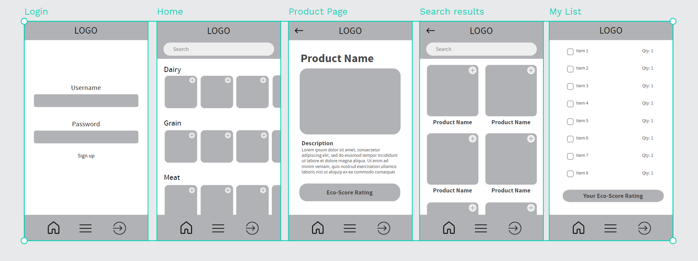
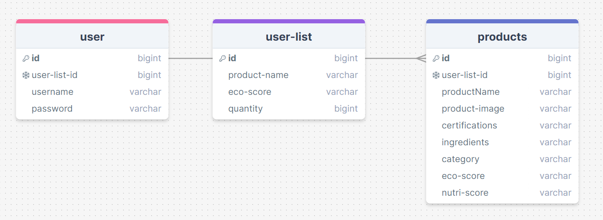

# Listainable

## Overview

Listainable is a grocery list app that allows users to search for grocery items and add to a list. Users are given a average sustainability rating based on their selected products.

### Dev Setup 

1. npm i to set up node modules
2. set up a .env for the server side
3. npm run seed to seed the your database with base data
4. npm start for front-end, npm run dev for back end and you're up and running!

### Problem

Trying to shop sustainably is famously difficult, especially with more more companies getting better at greenwashing products making it seem good for the environment when it is not. Based on a <a href="http://www.bccdc.ca/Documents/Food_Costing_in_BC_2022_Report_FINAL.pdf">survey</a> conducted by the BCCDC the average person spends over $300 a month on groceries. Since we all have to grocery shop I thought, how might we give consumers more power to shop sustainably.

### User Profile

#### Demographics

- **Age**: 25 - 45
- **Location**: Cities and urban areas
- **Income**: $35K - $70K per year

#### Psychographics

- **Interest and hobbies**: Passionate about sustainability, likes being organized, enjoys cooking, meal prepping and enjoys DIY projects.
- **Lifestyle**: Busy, looks to find more sustainable options in their everyday life, taking care of a family.
- **Values and beliefs**: Tries their best to lower their envinmental impact, values transparency on environmental practices from companies, advocates for reducing food waste.
- **Pain Points**: Struggles to find the time to research products, has a difficult time finding information on products, finds grocery shopping difficult with with a partner or kid.

#### Usage

- Users will search for items based on certain criteria such as:
  - Eco-score
  - Category (dairy, grain, meat ect)
  - Dietary needs (vegan, vegetarian, ect)
  - Nutritional value
- Users can then add products to their list and check them off when products are purchased

### Features

List the functionality that your app will include. These can be written as user stories or descriptions with related details. Do not describe _how_ these features are implemented, only _what_ needs to be implemented.

- Users will open the app to find a **home page** with products of different categories sorted by eco-score from highest to lowest
  - From here you can:
    1. Search for a specific product in the search bar
    2. Add a product to your grocery list
    3. View a product page
    4. View your existing list
- If a user decides to **search** for a product they will be brought to a results page featuring a selection of products they searched for.
  - Users will be able to apply different filters to refine their search.
- If a user decides to add a product to their list, it will populate on thier list page.
  - Users may also adjust the quantity before adding to their list
- If a user decides to **click on a product** they will get the product details where they can add a product to thier list and view information like:
  - Eco-score
  - Nutritional score
  - Ingredients
  - Certifications
  - Vegan or vegetarian
- If a user goes to thier **list page** they can:
  - View products they have added to thier list
  - Edit the quantity
  - Delete an item from thier list
  - View thier average Eco-score for this list/grocery run

## Implementation

### Tech Stack

- React
- Sass
- Express
- MySQL
- Client libraries:
  - react
  - react-router
  - axios
  - swiper for sliders
  
- Server libraries:
  - knex
  - express
  - fuse.js

### APIs

<a href="https://world.openfoodfacts.org/files/api-documentation.html"> OpenFoodFacts API</a>

### Sitemap

- Login/signup page
  - where users can login or signup
- Home page
  - Sliders with products
- Search result page
  - List of products filtered by search criteria
- Product page
  - Product info and add to list button
- List page
  - List with all selected items

### Mockups



### Data

- Product data comes directly from the OpenFoodFacts API to populate the products
  - Data can be partially filtered in the API call
  - Data will be finally filtered and put into a products table so products can load faster and information is more easily accessable
- Users will have an account that stores their id, username, password, and the id of their list
- Each user will be able to one list which contains the table id, productname, ecoScore and quantity
  - Users will be able to add, delete, and edit that quantity of items on the list



### Product Endpoints

**GET OpenFoodFacts API**

- Get request to get data from the OpenFoodFacts API
- URLs will be different depending on category and filtering infomation
  - i.e. getting a 10 products from 1 category
- Will be making 1 request per category to get 10 products from each category

Example response:

- I won't paste the JSON here as it's is a massive amount of information. It can be filtered to an extent through the API but but will be filtered in a separate request to my database

**POST /products**

- Filter and add new products to database

Parameters:

- product-name
- certifications: labels and certification like organic, rainforest alliance, no gluten, ect.
- ingrdients: an array of strings
- category: string
- ecoscore: string - a letter grade determining how environmentally friendly a product is
- nutriscore: string - a letter grade to determine how nutricious a product is

Example Response:

```
{
    "product-name": "Nutella",
    "product-image": "image-url",
    "certifications": [
      "No gluten",
      "Vegetarian",
    ]
    "ingredients": [
      "ingredient1",
      "ingredient2",
      "ingredient3"
    ],
    "category": "Condiment"
    "eco-score": "c",
    "nutri-score": "d",
}
```

**GET /product/category**

- Get products of a certain category to display on **home page**

Parameters:

- category

Example Response:

```
{
    "product-name": "Nutella",
    "product-image": "image-url",
    "category": "Condiment"
    "eco-score": "c",
    "nutri-score": "d",
}
```

### List Endpoints

**POST /list**

- Add new list item

Parameters:

- token: JWT of logged in user
- product-name
- ecoscore
- quantity: input when adding item to list

Example Response

```
{
    "id": 1
    "product-name": "Nutella",
    "product-image": "image-url",
    "ecoscore": "c",
    "quantity": 4,
}
```

**PUT /list/:id**

- Edit list item

Parameters:

- token: JWT of logged in user
- id: list item id
- quantity: amount of the item

Example Response:

```
{
    "id": 1
    "product-name": "Nutella",
    "product-image": "image-url",
    "ecoscore": "c",
    "quantity": 2,
}
```

**DELETE /list/:id**

- Delete list item

Parameters:

- token: JWT of logged in user
- id: list item id

### User Endpoints

**POST /users/register**

- Add a user account

Parameters:

- email: User's email
- password: User's provided password

Response:

```
{
    "token": "seyJhbGciOiJIUzI1NiIsInR5cCI6IkpXVCJ9.eyJzdWIiOiIxMjM0NTY3ODkwIiwibmFtZSI6I..."
}
```

**POST /users/login**

- Login a user

Parameters:

- email: User's email
- password: User's provided password

Response:

```
{
    "token": "seyJhbGciOiJIUzI1NiIsInR5cCI6IkpXVCJ9.eyJzdWIiOiIxMjM0NTY3ODkwIiwibmFtZSI6I..."
}
```

### Auth

- JWT auth
  - Before adding auth, all API requests will be using a fake user with id 1
  - Added after core features have first been implemented
  - Store JWT in localStorage, remove when a user logs out
  - Add states for logged in showing different UI in places listed in mockups

## Roadmap

Scope your project as a sprint. Break down the tasks that will need to be completed and map out timeframes for implementation. Think about what you can reasonably complete before the due date. The more detail you provide, the easier it will be to build.

- Create client

  - react project with routes and boilerplate pages

- Create server

  - express project with routing, with placeholder 200 responses

- Create migrations

- Gather 5 sample products for 3 different categories

- Create seeds with sample product data

- Deploy client and server projects so all commits will be reflected in production

- Feature: Product page

  - Create GET for OpenFoodFacts API endpoint
  - Create POST /products
  - Implement product details page

- Feature: Home page

  - Create GET /product/category
  - Implement react-multi-carousel library

- Feature: Search

  - Implement search function via fuse.js

- Feature: List page

  - Create POST /list
  - Create PUT /list/:id
  - Create DELETE /list/:id
  - Implement List page

- Feature: Create account

  - Implement register page + form
  - Create POST /users/register endpoint

- Feature: Login

  - Implement login page + form
  - Create POST /users/login endpoint

- Feature: Implement JWT tokens

  - Server: Update expected requests / responses on protected endpoints
  - Client: Store JWT in local storage, include JWT on axios calls

- Bug fixes

- DEMO DAY

## Nice-to-haves

- Favourites list
- Cast list to mobile lock screen
- Bring your reusable bag reminder
- Save history of previously selected items
- Highlight products that are in season
- Collaborative grocery lists - (i.e. couples can share a list)
- Create gorcery list for a store of user choosing
- Geolocation to find stores near you where you can see that store's options
- Access to Coupon/deals for items
- Pricing of similar items from store to store
- Make grocery list by recipes
- Include Farmers markets
- Organize products by store - need access to store inventory
- Replace item suggestions if out of stock
